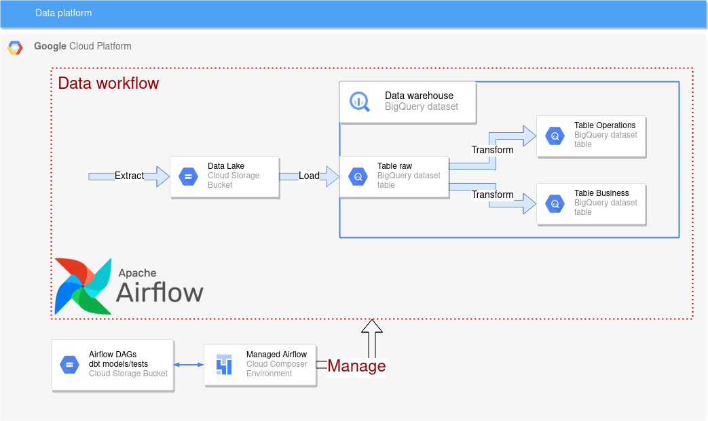
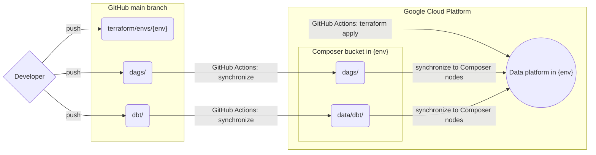

# gcp-data-platform
> Status: Ready to be used

Deploy a platform to manage your data workflows in Google Cloud Platform.

## About the project
This project is a way for me to learn more about the data engineering field by applying its core concepts and practicing with related technologies.

## Platform description
The platform is hosted on Google Cloud Platform and includes:
- an Apache Airflow as your workflow management platform
- a Google Storage bucket as your data lake
- a BigQuery dataset as your data warehouse

Some features are available to improve your workflows:
- infrastructure has been written as code with Terraform
- the framework dbt to help on your transformation workflow
- GitHub Actions as a continuous integration and delivery solution 

## Architecture overview

## Getting started
To deploy your data platform, please follow the instructions from that [document](docs/getting-started.md)

## CI/CD implementation
GitHub Actions will be triggered in the following conditions:

## Roadmap
### Infrastructure
- [x] Infrastructure as code (via Terraform) for a data platform Airflow managed by Cloud Composer
- [x] Infrastructure as code for BigQuery dataset(s) and Storage bucket(s)
- [ ] Infrastructure as code for the data platform Airflow built on GKE
- [ ] Code is duplicated for staging and prod environments

### Data
- [x] Framework dbt ready to be used in your data pipelines
- [x] Basic data pipeline available to explain how to create your own data pipeline
- [ ] Complex data pipelines

### Automation
- [x] CI/CD for infrastructure via GitHub Actions
- [x] CI/CD for Airflow DAGs via GitHub Actions
- [x] CI/CD for dbt models/tests via GitHub Actions
- [x] Bot checking updates for Terraform via GitHub Dependabot
- [ ] Bot checking updates for Python packages via GitHub Dependabot
- [ ] Switch to Workload identity federation for GCP authentication

Feel free to request a new features or to report an issue.
