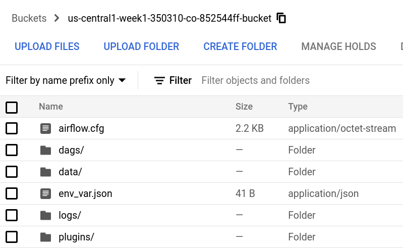

# Getting started
## Before you start
You will need to perform some actions manually before you can create your data platform.

### Google Cloud Platform
- A storage bucket to use as your terraform backend.
- A service account with permissions to create the resources from the terraform code including the IAM policies. It will be used by GitHub Actions. Create a new json key for a future step.

### GitHub requirements
#### If you want to use GitHub Actions to deploy your code
- Fork the project
- Create a repository secret (Settings > Security > Secrets > Actions).
  - Name: GOOGLE_CREDENTIALS
  - Value: {Your_GCP_service_account_json_key_content}

#### If you plan to deploy everything manually
- Clone the project

## Deploy the infrastructure

### Prepare the terraform code with your inputs
Modify the terraform backend configuration [backend.tf](../terraform/environments/dev/backend.tf).
```terraform
# terraform/environments/{dev/staging/prod}/backend.tf

terraform {
  backend "gcs" {
    bucket = "{your_bucket"
    prefix = "{bucket_destination}"
  }
}
```

Modify the GCP provider [providers.tf](../terraform/environments/dev/providers.tf).
```terraform
# terraform/environments/{dev/staging/prod}/providers.tf

provider "google" {
  project = "{your_gcp_project_id}"
  region  = "{your_gcp_project_region}"
}
```

Modify the inputs related to your GCP environment [locals.tf](../terraform/environments/dev/locals.tf).
```terraform
# terraform/environments/{dev/staging/prod}/locals.tf

locals {
  environment        = "{dev/staging/prod}"
  gcp_project_id     = "{your_gcp_project_id}"
  gcp_project_region = "{your_gcp_project_region}"

  bigquery_dataset = "{dataset_name_you_will_create}"
  data_location    = "{data_location}"

  # Feel free to modify or add labels
  labels = {
    "environment" = local.environment,
    "managed-by"  = "terraform",
  }
}
```

### Let GitHub Actions deploy the infrastructure (Optional)
Push the changes you have made in the previous steps to your fork main branch.
I recommend to do it via a Pull Request as it will trigger a check on your code.
GitHub Actions should trigger a new deployment.

The deployment will take around 25mn to finish (because of Cloud Composer).

### Deploy infrastructure yourself (Optional)
If you don't want to rely on GitHub Actions to deploy the infrastructure.  
Install [terraform](https://www.terraform.io/) on your computer. I recommend to do it with the version manager [tfenv](https://github.com/tfutils/tfenv).  
With tfenv you can switch automatically to the specific version set in your Terraform project folder by creating a [.terraform-version](../terraform/.terraform-version) file.

Access the Terraform environment folder you want to target.
```console
cd terraform/environments/{dev/staging/prod}
```
Initialize your Terraform project.
```console
terraform init
```
Apply the Terraform changes. Terraform will show you the expected outputs which you can approve or not.
```console
terraform apply
```
The deployment will take around 25mn to finish (because of Cloud Composer).


## Enable dbt framework for your data pipelines (optional)
If you want to use dbt for your data transformation in your data pipelines, you will have to configure the folder [dbt](../dbt/) and upload it to the GCS bucket created and used by Cloud Composer in the data folder.

### Prepare the dbt configuration folder

Modify the dbt profile to interact with the BigQuery dataset created with this project [profiles.yml](../dbt/profiles.yml) 
```yml
# dbt/profiles.yml

{profile_name}:
  target: {dev/staging/prod}
  outputs:
    {dev/staging/prod}:
      type: bigquery
      method: oauth
      project: {your_gcp_project_id}
      dataset: {bq_dataset_name_created_with_terraform}
      threads: 1
```

Modify the dbt project configuration file [dbt_project.yml](../dbt/dbt_project.yml) 
```yml
# dbt/dbt_project.yml

name: '{dbt_project_name}'
version: '1.0.0'
config-version: 2

# This setting configures which "profile" dbt uses for this project.
profile: '{profile_name_from_profiles.yml}'

model-paths: ["models"]
analysis-paths: ["analyses"]
test-paths: ["tests"]
seed-paths: ["seeds"]
macro-paths: ["macros"]
snapshot-paths: ["snapshots"]

target-path: "target"
clean-targets:
  - "target"
  - "dbt_packages"

# Feel free to modify this section based on your models structure
models:
  {dev/staging/prod}:
    materialized: table 
```

To finish modify the sources file [sources.yml](../dbt/models/sources.yml) 
```yml
# dbt/models/sources.yml

version: 2

sources:
  - name: {source_name}
    dataset: {bq_dataset_name_created_with_terraform}
    project: {your_gcp_project_id}
    tables:
      - name: {table_you_will_create}
      - ...
```

#### Upload the dbt folder to the GCS bucket used by Cloud Composer
After your Cloud Composer environment is ready to use you should have a new GCS bucket created for you named '{region}-{project-id}-{random-id}-bucket'.  
The content of this bucket is automatically filled by Cloud Composer as below



Upload the dbt folder in the folder 'data/' you have previously configured.


## Synchronization between Cloud Composer bucket and GitHub 
In the precedent steps we have explained how to upload your dbt and dags folders to the GCS bucket used by Composer.  
If you gave GCP credentials to GitHub Actions via a repository secret, it will synchronize the bucket for you every time you update the folders dags and/or dbt.
